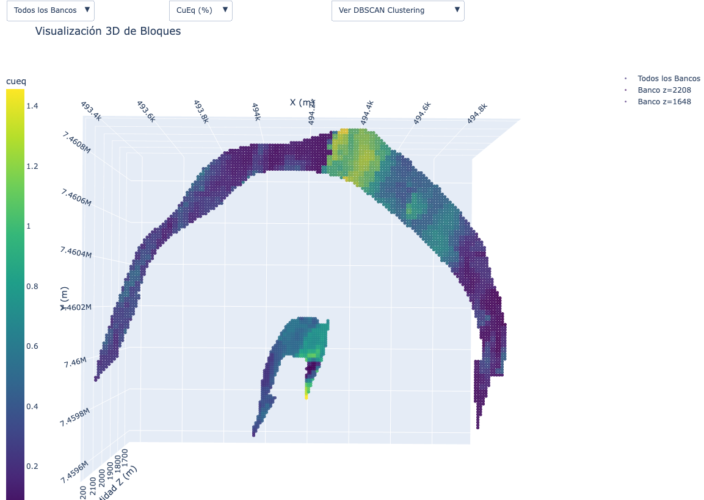
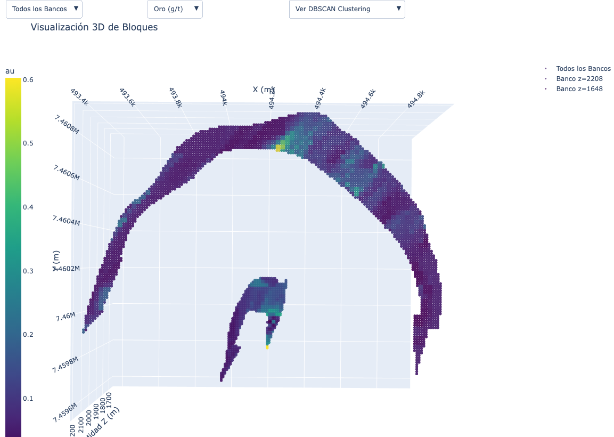
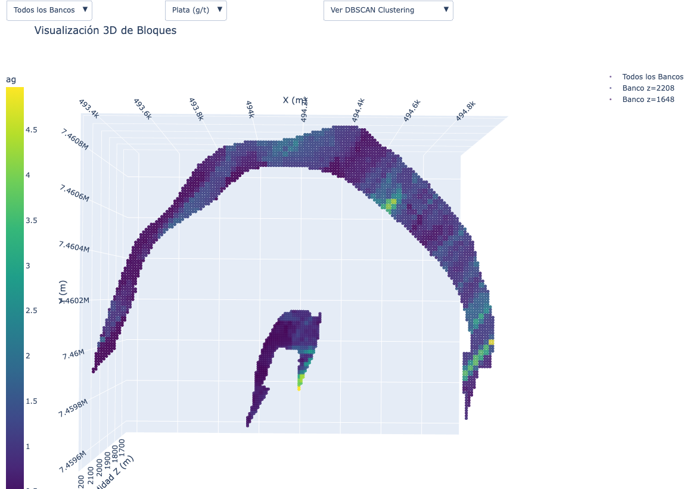
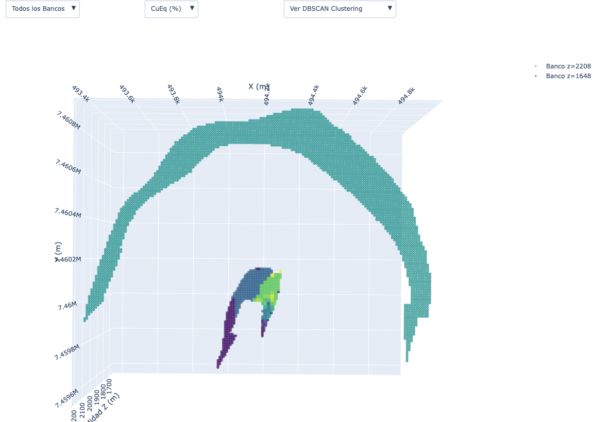
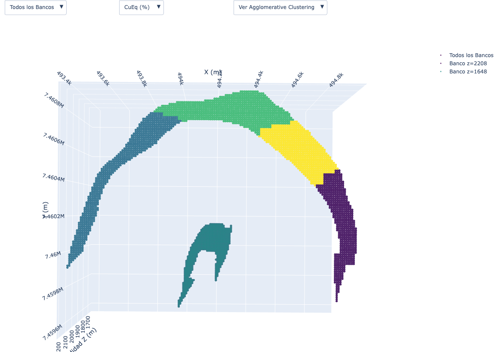
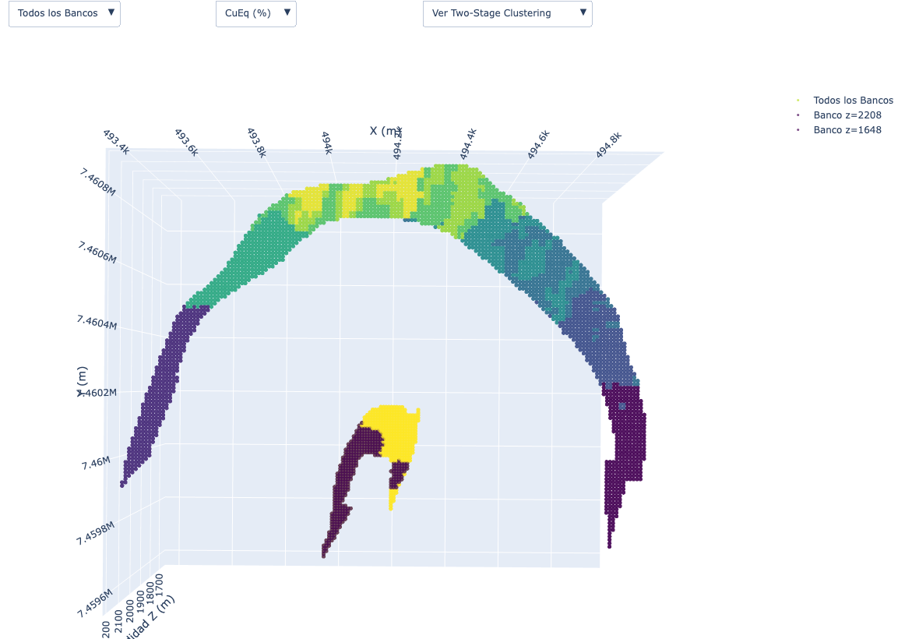
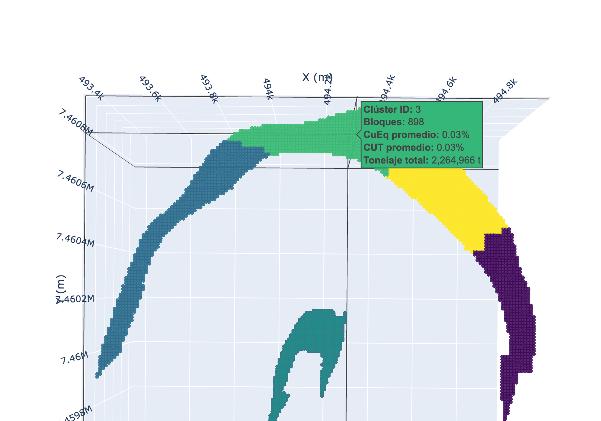
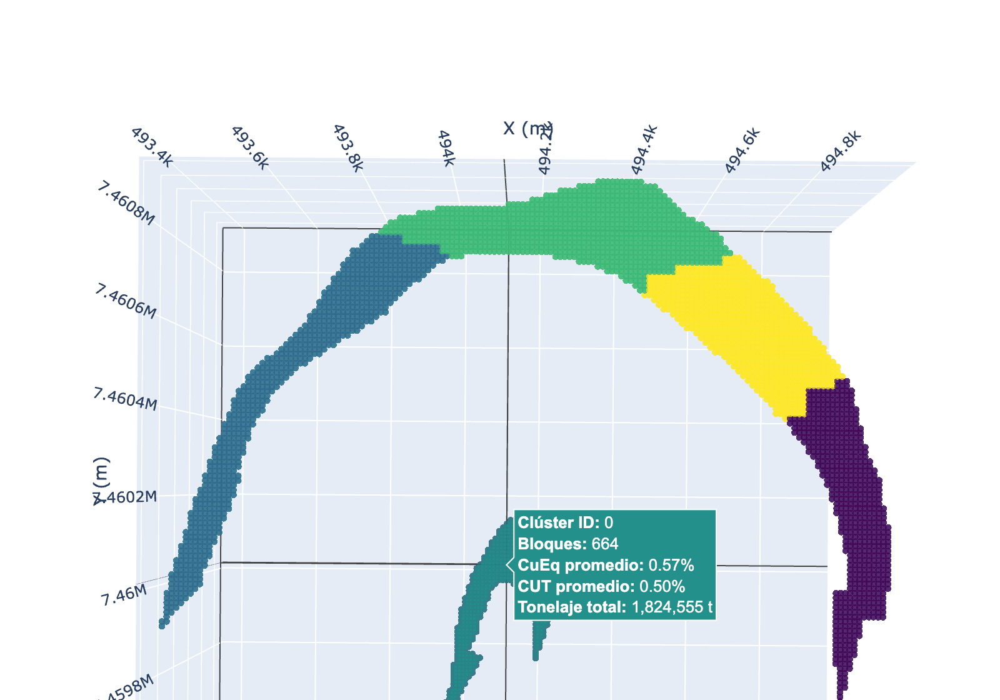
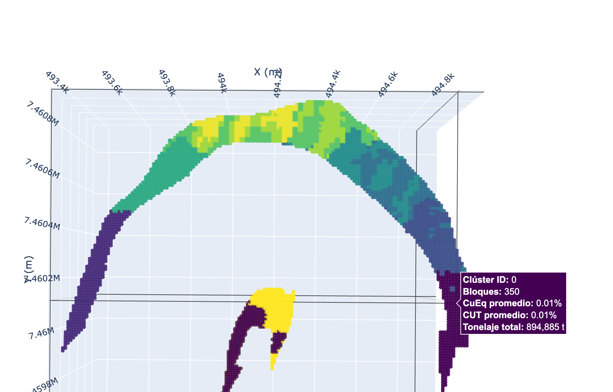

# Optimización y Agrupamiento de Bancos de Perforación - Proyecto TecMin

Proyecto académico desarrollado en el curso **IMM3521 - Tecnologías Mineras** de la **Pontificia Universidad Católica de Chile**. El objetivo es aplicar técnicas de *machine learning* no supervisado para agrupar bloques de un modelo de bloques minero en unidades o polígonos de extracción con sentido espacial, geológico y operacional.

Este repositorio se publica como material educativo y de referencia para estudiantes o personas interesadas en la aplicación de algoritmos de clustering en planificación minera de corto plazo.

---

## Descripción general

La planificación minera de corto plazo requiere transformar un modelo de bloques en unidades de extracción operativamente manejables. Estas unidades deben mantener continuidad espacial y, al mismo tiempo, ser razonablemente homogéneas en atributos relevantes como leyes minerales, densidad, tipo de material o litología.

En este proyecto se trabajó con un archivo de entrada `bancos.xlsx`, correspondiente a bloques de dos bancos del modelo. A partir de sus coordenadas espaciales y variables geometalúrgicas, se implementaron y compararon distintos enfoques de clustering:

- **DBSCAN**, para identificar agrupamientos espaciales basados en densidad y detectar posibles puntos aislados.
- **Agglomerative Clustering**, para generar agrupamientos jerárquicos a partir de similitud entre bloques.
- **Two-Stage Clustering / 2-Estrategias**, inspirado en el enfoque de Tabesh & Askari-Nasab (2011), considerando similitud espacial y atributos de ley para generar clusters más cercanos a unidades minables.

La evaluación se realizó mediante métricas internas de clustering y análisis visual 3D de los resultados.

---

## Objetivos

- Cargar y procesar un modelo de bloques desde un archivo Excel.
- Explorar atributos espaciales y geometalúrgicos relevantes.
- Implementar algoritmos de clustering no supervisado aplicados a datos mineros.
- Comparar los resultados usando métricas como **Silhouette Score**, **Davies-Bouldin Index** y **Calinski-Harabasz Index**.
- Visualizar los bloques y clusters en 3D usando Plotly.
- Incorporar información resumida de cada cluster mediante etiquetas interactivas al pasar el cursor sobre los bloques.
- Analizar la aplicabilidad operacional de los agrupamientos generados.

---

## Galería visual

A continuación se muestran algunas de las visualizaciones más representativas del proyecto. Para el README se incorporaron capturas recortadas y renombradas, de manera que se vea directamente la parte relevante de cada figura.

### Distribución de variables del modelo de bloques

| Cobre equivalente (`cueq`) | Oro (`au`) |
|---|---|
|  |  |

| Plata (`ag`) |
|---|
|  |

### Resultados de clustering

| DBSCAN | Agglomerative Clustering |
|---|---|
|  |  |

| Two-Stage Clustering / 2-Estrategias |
|---|
|  |

### Hover interactivo con resumen por cluster

Además de la visualización 3D, el proyecto incluye una pequeña extensión interactiva: al pasar el cursor del mouse sobre un bloque en las vistas de clustering, se despliega un resumen agregado del cluster al que pertenece.

| Agglomerative Clustering — cluster superficial | Agglomerative Clustering — cluster interno |
|---|---|
|  |  |

| Two-Stage Clustering / 2-Estrategias — cluster con resumen |
|---|
|  |

Esta interacción permite consultar rápidamente información resumida como:

- **ID del cluster**
- **Número de bloques**
- **Ley promedio de CuEq**
- **Ley promedio de CUT**
- **Tonelaje total estimado**

---

## Funcionalidad interactiva

La visualización 3D fue complementada con **hover text personalizado en Plotly**, de manera que el gráfico no solo muestre la distribución espacial de los bloques, sino que además sirva como una herramienta de inspección rápida de resultados.

Al pasar el cursor sobre un bloque dentro de cualquiera de los métodos de clustering, la figura muestra un resumen del cluster correspondiente. Esta extensión resulta especialmente útil para interpretar los agrupamientos sin necesidad de consultar tablas externas por separado.

En términos prácticos, esta funcionalidad ayuda a:

- identificar rápidamente clusters grandes o pequeños,
- comparar zonas de mayor o menor ley,
- revisar la magnitud del tonelaje agrupado,
- y evaluar si el agrupamiento tiene coherencia geológica y operacional.

---

## Estructura del repositorio

```text
.
├── .gitignore
├── LICENSE
├── README.md
├── requirements.txt
├── main.py
├── clustering.py
├── parameters.py        # Archivo de parámetros configurables
├── bancos.xlsx
└── figures/
    ├── distribucion_3d_cueq.png
    ├── distribucion_3d_oro.png
    ├── distribucion_3d_plata.png
    ├── clusters_dbscan_3d.png
    ├── clusters_agglomerative_3d.png
    ├── clusters_two_stage_3d.png
    ├── hover_agglomerative_cluster_3.png
    ├── hover_agglomerative_cluster_0.png
    └── hover_two_stage_cluster_0.png
```

> Nota: si el proyecto se sigue actualizando, conviene mantener fuera del repositorio archivos generados automáticamente como `__pycache__/`, `.DS_Store`, carpetas `__MACOSX/` y entornos virtuales como `.venv/`.

---

## Datos de entrada

El archivo `bancos.xlsx` contiene un modelo de bloques con variables espaciales y geometalúrgicas. Las columnas principales utilizadas por el código son:

| Columna | Descripción |
|---|---|
| `x` | Coordenada Este del bloque |
| `y` | Coordenada Norte del bloque |
| `z` | Cota o banco del bloque |
| `cut` | Ley de cobre total |
| `cus` | Ley de cobre soluble |
| `au` | Ley de oro |
| `ag` | Ley de plata |
| `cueq` | Ley de cobre equivalente |
| `density` | Densidad del bloque |
| `material` | Clasificación o destino del material |
| `Fase` | Fase asociada al bloque |

El script también calcula una estimación de tonelaje cuando la columna `tonelaje` no existe, usando la densidad como base de referencia.

---

## Algoritmos implementados

### 1. DBSCAN

DBSCAN agrupa puntos en función de su densidad local. Es útil para detectar zonas compactas y reconocer puntos que no pertenecen claramente a ningún cluster.

Parámetros principales:

- `eps`: radio de vecindad.
- `min`: número mínimo de puntos requeridos para formar una zona densa.

### 2. Agglomerative Clustering

Método jerárquico que parte considerando cada bloque como un cluster individual y luego fusiona grupos según su similitud. En este proyecto se aplica sobre variables normalizadas como `x`, `y`, `z` y `cueq`.

Parámetro principal:

- `nofcluster`: número final de clusters deseado.

### 3. Two-Stage Clustering / 2-Estrategias

Implementación simplificada inspirada en metodologías de agregación de bloques para minería a cielo abierto. Busca generar agrupamientos considerando proximidad espacial y similitud en leyes, con un límite máximo de tamaño por cluster.

Parámetros principales:

- `max_cluster`: tamaño máximo permitido para cada cluster.
- `similarity`: umbral de similitud para agrupar bloques.

---

## Instalación

Se recomienda crear un entorno virtual antes de ejecutar el proyecto.

```bash
python3 -m venv .venv
source .venv/bin/activate      # macOS/Linux
# .venv\Scripts\activate      # Windows
```

Luego instala las dependencias con:

```bash
python -m pip install --upgrade pip
pip install -r requirements.txt
```

El archivo `requirements.txt` contiene:

```text
pandas
numpy
scikit-learn
plotly
openpyxl
```

---

## Ejecución

Para correr el proyecto, ubica `bancos.xlsx` en la misma carpeta que los scripts y ejecuta:

```bash
python main.py
```

El programa realiza el siguiente flujo:

1. Carga los datos desde `bancos.xlsx`.
2. Verifica que existan las columnas necesarias.
3. Normaliza las variables usadas para clustering.
4. Ejecuta DBSCAN, Agglomerative Clustering y 2-Estrategias.
5. Calcula estadísticas por cluster, como número de bloques, tonelaje total y leyes promedio.
6. Genera una visualización 3D interactiva con Plotly, incluyendo información resumida por cluster al pasar el cursor sobre cada bloque.
7. Imprime métricas de evaluación en consola.

---

## Configuración de parámetros

Los parámetros principales se editan en `paramaters.py`:

```python
# DBSCAN
eps = 0.2
min = 3

# Agglomerative Clustering
nofcluster = 5

# Algoritmo 2TA
max_cluster = 350
similarity = 9
```

Para replicar escenarios similares a los analizados en el informe final, se pueden probar configuraciones como:

```python
# DBSCAN, caso base de sensibilidad
eps = 0.1
min = 5

# Agglomerative Clustering
nofcluster = 15

# 2-Estrategias
max_cluster = 250
similarity = 3.75
```

---

## Métricas de evaluación

El proyecto calcula tres métricas internas de validación de clustering:

| Métrica | Interpretación |
|---|---|
| Silhouette Score | Mide cohesión interna y separación entre clusters. Valores más altos indican mejor agrupamiento. |
| Davies-Bouldin Index | Mide similitud entre clusters. Valores más bajos indican menor solapamiento. |
| Calinski-Harabasz Index | Mide separación entre clusters respecto a la dispersión interna. Valores más altos indican mejor estructura. |

En el informe académico, **Agglomerative Clustering** obtuvo el mejor desempeño numérico general, mientras que **DBSCAN** presentó un buen comportamiento en Davies-Bouldin. El enfoque **2-Estrategias** resultó especialmente interesante desde el punto de vista operacional, al integrar criterios espaciales y de ley mineral.

---

## Resultados principales

Los resultados mostraron que los distintos métodos responden de manera diferente al problema de agrupamiento:

- **DBSCAN** permite detectar agrupamientos compactos y posibles bloques aislados, pero es sensible a la elección de `eps`.
- **Agglomerative Clustering** genera segmentaciones estables y presentó el mejor desempeño en métricas clásicas de clustering.
- **2-Estrategias** incorpora mejor el criterio minero-operacional, ya que considera similitud espacial y atributos de ley, aunque requiere calibración cuidadosa de parámetros.

En términos prácticos, la selección del algoritmo depende del objetivo del análisis. Para exploración rápida y segmentación espacial, DBSCAN o Agglomerative Clustering son buenas alternativas. Para generar unidades minables con mayor coherencia geológica y operacional, un enfoque tipo 2-Estrategias puede ser más adecuado.

---

## Limitaciones

- El modelo de bloques utilizado contiene solo dos bancos, lo que limita el análisis de continuidad vertical.
- La implementación de 2-Estrategias corresponde a una aproximación simplificada y no a una reproducción completa del algoritmo original de Tabesh & Askari-Nasab.
- Los resultados dependen fuertemente de la calibración de parámetros.
- Las métricas internas de clustering no reemplazan la validación minera, geológica ni operacional.
- Para aplicaciones reales, se deberían incorporar restricciones adicionales, como accesibilidad, precedencias, anchos mínimos de extracción, dilución, recuperación metalúrgica y restricciones de equipos.

---

## Posibles mejoras futuras

- Incorporar más bancos para analizar continuidad vertical.
- Añadir restricciones espaciales explícitas de adyacencia.
- Implementar K-Medoids o Spectral Clustering para comparación adicional.
- Exportar los clusters resultantes a formatos GIS o archivos compatibles con software minero.
- Separar el flujo en notebooks explicativos para facilitar el uso docente.
- Guardar automáticamente las métricas y figuras en una carpeta `results/`.
- Agregar pruebas de sensibilidad parametrizadas.

---

## Referencia principal

Tabesh, M., & Askari-Nasab, H. (2011). *Two-stage clustering algorithm for block aggregation in open pit mines*. *Mining Technology, 120*(3), 158-169.

---

## Uso de herramientas de IA generativa

Durante el desarrollo del proyecto se utilizaron herramientas de inteligencia artificial generativa, incluyendo modelos de lenguaje como ChatGPT, como apoyo complementario en distintas etapas del trabajo. Su uso estuvo orientado principalmente a la generación de ideas, revisión de estructura del código, depuración de errores, mejora de la documentación, redacción del README y organización general del repositorio.

Las decisiones metodológicas, la selección de algoritmos, la interpretación de resultados, la validación de métricas y el análisis minero-operacional fueron desarrollados y revisados por el equipo. Por lo tanto, el uso de IA se considera una herramienta de asistencia técnica y documental, no un reemplazo del criterio ingenieril ni de la autoría académica del proyecto.

---

## Informe académico

Este repositorio resume la implementación computacional y los principales resultados del proyecto. El informe académico completo fue desarrollado como entrega final del curso IMM3521 - Tecnologías Mineras. Por motivos de privacidad académica y uso responsable de los datos, el documento completo no se incluye directamente en el repositorio público, pero puede ser compartido bajo solicitud.

--- 

## Autores

Proyecto desarrollado por el **Equipo 2** en el contexto del curso **IMM3521 - Tecnologías Mineras**, Departamento de Ingeniería de Minería, Pontificia Universidad Católica de Chile.

Integrantes:

- Matías Alarcón
- [Miguel Farias](https://linkedin.com/in/miguelfariasuc)
- Cristóbal Mi
- Javiera Rojas-Murphy

---

## Uso académico

Este repositorio se publica con fines educativos y de referencia. Puede ser útil para estudiantes interesados en minería, planificación minera, análisis de modelos de bloques, aprendizaje no supervisado y visualización 3D de datos espaciales.

Si usas este repositorio como referencia, se recomienda citarlo o mencionar su origen académico.
